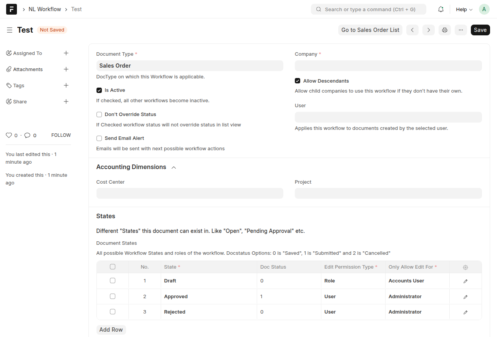
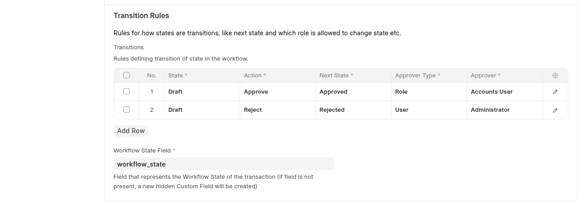
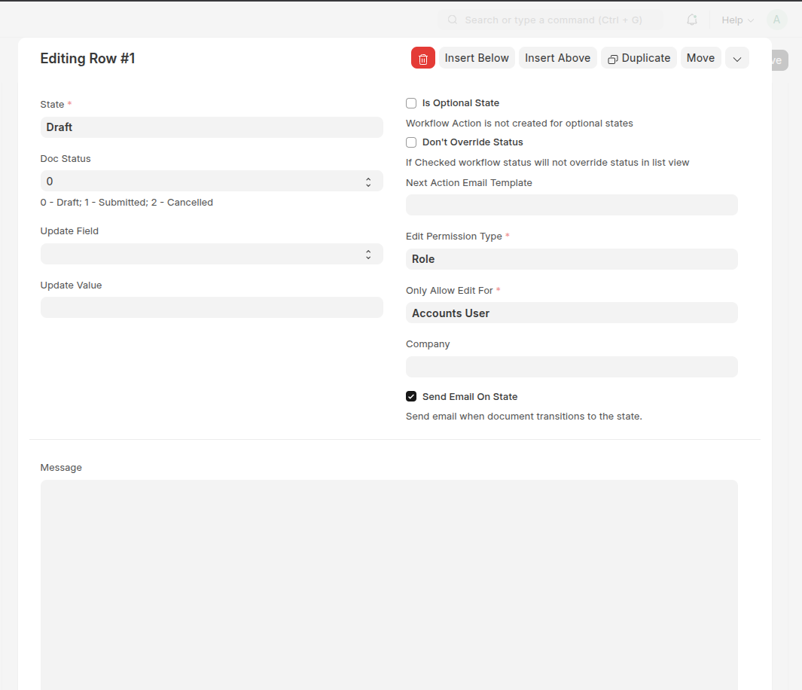
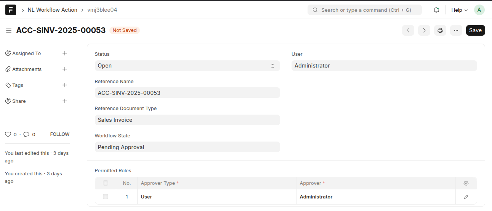
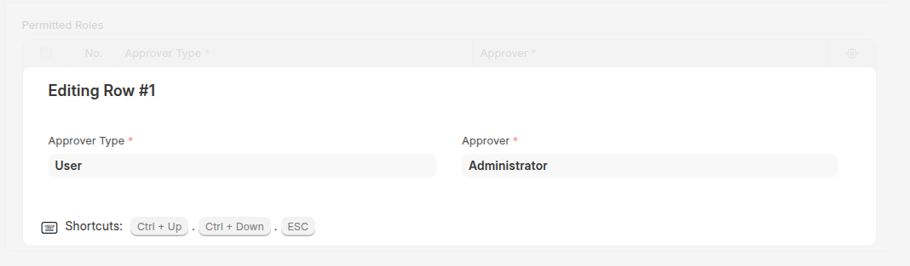
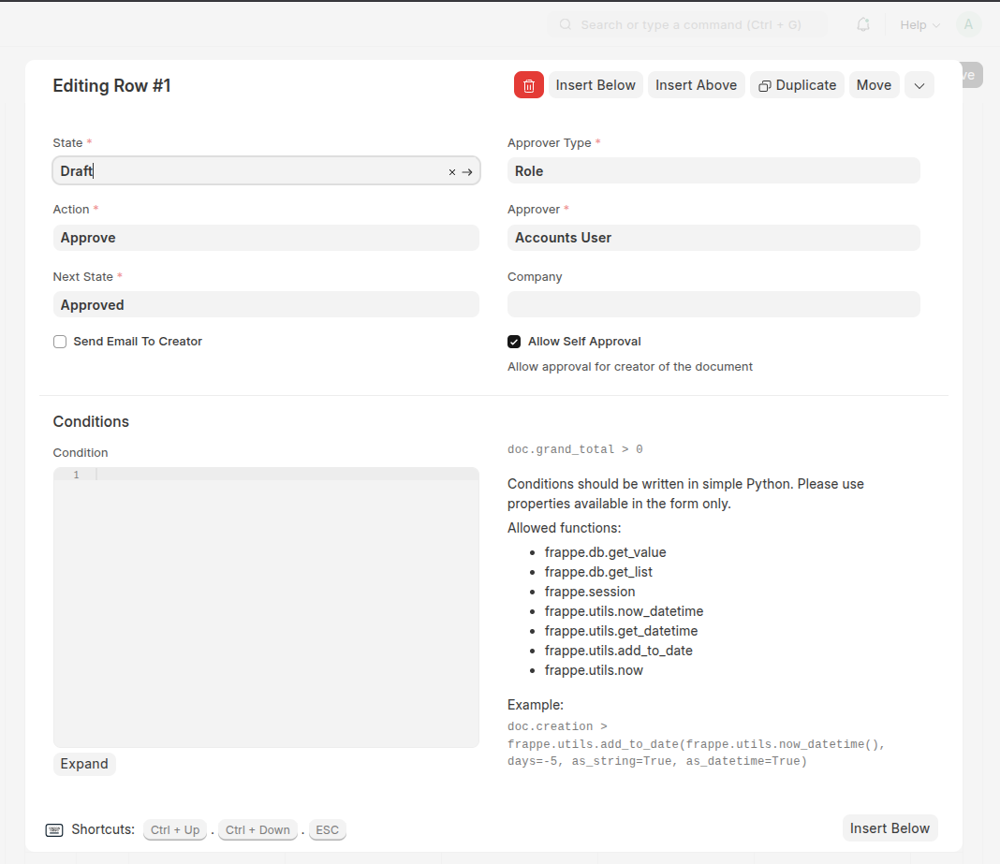

# 🚀 Frappe Workflow Extension

An advanced extension to **Frappe’s Workflow system** that introduces **multi-scenario**, **multi-assignment**, and **flexible approval logic**.

This app expands Frappe’s native workflows to handle **diverse allocation models** — allowing actions and approvals to be assigned to both **specific users and roles**, and enabling **multiple active workflows** for the same doctype under different contexts.

---

## ✨ Key Features

### 🧩 1. Multi-Scenario Workflow Support

Define **multiple workflows for the same doctype**, each triggered under different conditions — such as:

- Company or parent company
- Project or cost center
- User or user role
- Accounting dimension values (e.g. branch, department, region)

This makes it possible to manage distinct approval routes within a single organization or across multiple companies.

> Example:  
> A “Sales Invoice” can follow one workflow for _Head Office_ and another for _Regional Branches_, each with its own approvers and rules.

---

### 👥 2. Combined Role + User Assignment

Frappe’s built-in workflow restricts assignments to either users **or** roles — not both.  
This extension enables **mixed allocation**, where a workflow state or transition can specify:

- A **specific user** (e.g., `john.doe@example.com`)
- A **user role** (e.g., `Accounts Manager`)
- Or **both**, for flexible access control.

This allows configurations like:

> “This approval can be performed by either the _Finance Manager role_ or the _assigned project accountant user_.”

---

### 🧭 3. Intelligent Workflow Selection Logic

Automatically determines which workflow applies to a document (`doctype`, optional `docname`) using a well-defined priority hierarchy:

1. **Closest Company in the Tree** — use current company if defined, or the nearest parent with `allow_descendants = 1`.
2. **User-specific Workflows** — apply flows tied to the document owner.
3. **Accounting Dimensions** — match branch, department, or any configured dimension.
4. **Cost Center and Project** — pick workflows tied to cost center or project context.
5. **Company-level Fallback** — use the top-level workflow if no finer match exists.

Ensures predictable behavior across complex multi-company or departmental setups.

---

### 🔐 4. Enhanced Workflow Actions & Permissions

- Each workflow action can define **permitted roles and users** through dedicated doctypes.
- Role and user matching happens dynamically — allowing fine-grained access control.
- Supports advanced use cases like delegated approvals or department-specific reviewers.

---

### 🏢 5. Hierarchical Company Awareness

- Workflows can **inherit** from parent companies using `allow_descendants`.
- The engine automatically picks the **nearest eligible parent** if a child company has no direct workflow.
- Prevents grandparent overrides and enforces company-level isolation.

---

### ⚙️ 6. Fully Compatible & Extensible

- Works seamlessly with all standard Frappe doctypes and the built-in Workflow system.
- Backward compatible — existing workflows continue to work unchanged.
- Custom Python or JS logic can be hooked via Server Scripts or Client Scripts.

---

## 🧠 Technical Highlights

| Feature                     | Description                                                  |
| --------------------------- | ------------------------------------------------------------ |
| **Multi-Scenario Logic**    | Multiple workflows per doctype, auto-selected by context     |
| **Role + User Allocation**  | Workflow actions can belong to both roles and specific users |
| **Company Tree Resolution** | Finds the closest applicable workflow in company hierarchy   |
| **Dynamic Dimensions**      | Reads accounting dimensions dynamically from system setup    |
| **Predictable Priority**    | Enforces a clear, documented order of evaluation             |
| **Safe Fallbacks**          | Raises clear errors for ambiguous or missing configuration   |

---

## 🧱 New Doctypes & Core Model Extensions

This app introduces enhanced doctypes that **extend Frappe’s native Workflow models**, enabling the mixed user-role allocation and multi-context logic described above.
Each of these doctypes mirrors its core Frappe counterpart but includes **additional fields and relationships** to support contextual, flexible workflows.

---

### 🧭 **NL Workflow**

> Extends Frappe’s built-in `Workflow` doctype to support **multi-scenario workflows**.

**New Fields Added:**

| Field                     | Description                                                                                                                     |
| ------------------------- | ------------------------------------------------------------------------------------------------------------------------------- |
| **Company**               | Links the workflow to a specific company in a multi-company setup.                                                              |
| **Allow Descendants**     | Boolean flag allowing child companies to inherit this workflow when no direct workflow is defined.                              |
| **User**                  | Assigns the workflow to a specific user (in addition to roles).                                                                 |
| **Project / Cost Center** | Enables project-based or cost-center-specific workflow routing.                                                                 |
| **Accounting Dimensions** | Dynamically includes other accounting dimension fields (e.g. Department, Region, Branch) for more granular workflow separation. |





---

### 📄 **NL Workflow Document State**

> Extends `Workflow Document State` to include **advanced edit control and mixed permissions**.

**New Fields Added:**

| Field                    | Description                                                                                               |
| ------------------------ | --------------------------------------------------------------------------------------------------------- |
| **Edit Permission Type** | Determines whether edit access is granted by _User_ or _Role_.                                            |
| **Only Allow Edit For**  | Dynamic link field connected to the selected `Edit Permission Type`, allowing flexible edit restrictions. |
| **Company**              | Restricts state applicability to a specific company context.                                              |



---

### ⚡ **NL Workflow Action**

> Enhances the `Workflow Action` doctype to support table-based permissions and flexible assignment.

**Key Changes:**

| Field               | Description                                                                                                                                |
| ------------------- | ------------------------------------------------------------------------------------------------------------------------------------------ |
| **Permitted Roles** | Now stored in a child table (`NL Workflow Action Permitted Role`) instead of a multi-select, allowing role-user combinations and metadata. |



---

### 🧑‍💼 **NL Workflow Action Permitted Role**

> New child doctype used for defining per-action access rules.

**Fields:**

| Field             | Description                                                              |
| ----------------- | ------------------------------------------------------------------------ |
| **Approver Type** | Select whether the permission applies to a _User_ or _Role_.             |
| **Approver**      | Dynamic link to either a `User` or `Role`, based on the `Approver Type`. |



---

### 🔄 **NL Workflow Transition**

> Extends `Workflow Transition` to include contextual fields for **company and approver configuration**.

**New Fields Added:**

| Field             | Description                                                       |
| ----------------- | ----------------------------------------------------------------- |
| **Company**       | Ensures transitions are context-specific to a company.            |
| **Approver Type** | Defines if approval is by _User_ or _Role_.                       |
| **Approver**      | Dynamic link tied to `Approver Type` for hybrid approval routing. |



---

### ⚡ Installation

You can install this app using the [bench](https://github.com/frappe/bench) CLI:

```bash
cd $PATH_TO_YOUR_BENCH
bench get-app https://github.com/navariltd/Frappe-Workflow-Extension.git --branch develop
bench install-app frappe_workflow_extension
```

## 📚 Documentation & Support

Need help? Browse detailed guides, FAQs, or open an issue in our GitHub repo.

[](https://github.com/navariltd/Frappe-Workflow-Extension/wiki)
[](https://docs.erpnext.com)
[](https://frappeframework.com/docs)
[](https://discuss.frappe.io)
[](https://github.com/navariltd/Frappe-Workflow-Extension/issues)
[](https://navari.co.ke)
